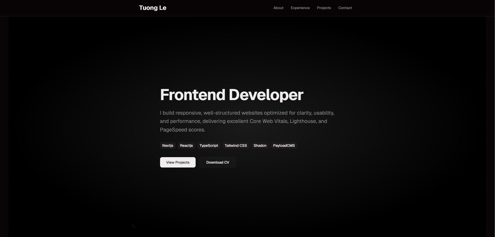

# 🚀 Next.js Portfolio

> Live demo: [tuongle.dev](https://www.tuongle.dev/)

---

<p align="center"> </p>


## 🚀 Getting Started

### 1. Clone the repository

```bash
git clone https://github.com/tuongle2604/portfolio-website.git
cd portfolio-website
```

### 2. Install dependencies

```bash
npm install
# or
pnpm install
```

### 3. Run the development server

```bash
npm run dev
# or
pnpm dev
```

Open [http://localhost:3000](http://localhost:3000) in your browser.

---

## 🧪 Scripts

| Command | Description              |
| ------- | ------------------------ |
| `dev`   | Start development server |
| `build` | Create production build  |
| `start` | Run production server    |
| `lint`  | Run ESLint               |


---


## 📄 License

This project is open-source and available under the **MIT License**.

---
